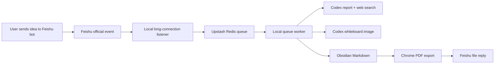

# Feishu Idea Catcher

一个基于飞书官方开放平台的个人灵感捕手：你给飞书机器人发一条想法，本地 worker 会自动记录到 Obsidian，调用 Codex 做轻量竞品扫描和 CEO Review，生成白板图、Markdown 报告和 PDF，再通过飞书发回给你。

这个项目坚持使用飞书官方 API 和官方长连接能力，不自动化个人客户端，不依赖非官方微信接口。

## Features

- 飞书机器人收集文字灵感
- Upstash Redis 队列，避免飞书回调超时
- Codex CLI 生成中文 CEO Review 报告
- Codex web search 做轻量竞品/先行者扫描
- Codex image generation 结合内置白板图 skill 生成配图
- Obsidian 自动归档 Markdown
- Chrome headless 自动导出 PDF
- 飞书官方文件 API 回传 PDF
- “快速记录，不用分析”模式

## Architecture



The listener only receives messages and enqueues jobs. The queue worker handles slow work: Codex, web search, image generation, Obsidian writes, PDF export, and Feishu file upload.

## Requirements

- Node.js 20+
- A Feishu/Lark self-built app with bot capability
- Upstash Redis REST database
- Obsidian vault on the local machine
- Codex desktop app or Codex CLI installed and logged in
- Google Chrome for PDF export
- Optional: Vercel, only if you want HTTP callback/API mode

## Quick Start

```bash
npm install
cp .env.example .env.local
```

Edit `.env.local` and fill:

- `WORKER_API_TOKEN`
- `UPSTASH_REDIS_REST_URL`
- `UPSTASH_REDIS_REST_TOKEN`
- `FEISHU_APP_ID`
- `FEISHU_APP_SECRET`
- `OBSIDIAN_IDEA_LIST_DIR`
- `OBSIDIAN_REPORT_DIR`
- `OBSIDIAN_VAULT_ROOT`
- `OBSIDIAN_VAULT_NAME`

Run checks:

```bash
npm run doctor
```

Start the Feishu listener:

```bash
npm run listener:feishu
```

Start the queue worker in another terminal:

```bash
npm run worker:queue
```

Now send a text message to your Feishu bot.

### Optional: Scheduled Local Startup

If you want Codex automations or another scheduler to start and stop the local processes, prefer the macOS launchd commands:

```bash
npm run launchd:start
npm run launchd:status
npm run launchd:stop
```

This registers the listener and queue worker as user LaunchAgents under `~/Library/LaunchAgents/`, with logs in `state/launchd-*.log`. This is more reliable than letting a sandboxed scheduler directly spawn long-running network processes.

For Codex automations, use prompts like:

```text
Start: run npm run launchd:start, wait 5 seconds, then run npm run launchd:status and summarize listener/worker status and PIDs.
Stop: run npm run launchd:stop, wait 3 seconds, then run npm run launchd:status and summarize whether services are not_loaded/stopped.
```

If you need to avoid LaunchAgent label conflicts with another checkout, set `LAUNCHD_LABEL_PREFIX` before running the command.

## Feishu Setup

Use a Feishu/Lark self-built app, not a simple incoming webhook bot.

1. Enable bot capability.
2. Grant message permissions, including receiving messages, sending messages, and uploading files.
3. In “Events and Callbacks”, choose long connection mode.
4. Subscribe to `im.message.receive_v1`.
5. Put `App ID` and `App Secret` into `.env.local`.

Long connection mode does not require `FEISHU_VERIFICATION_TOKEN` or `FEISHU_ENCRYPT_KEY`.

## Output

`idea list.md`:

```text
$OBSIDIAN_IDEA_LIST_DIR/idea list.md
```

Reports:

```text
$OBSIDIAN_REPORT_DIR/YYYYMMDD/YYYYMMDD-short-title.md
$OBSIDIAN_REPORT_DIR/YYYYMMDD/assets/YYYYMMDD-short-title/
```

Temporary PDFs:

```text
$PDF_OUTPUT_DIR/YYYYMMDD-short-title.pdf
```

PDFs are sent to Feishu and are not kept inside Obsidian by default.

## Report Structure

Each full report includes:

- `0. 一句话结论`
- `1. 这个想法到底是什么`
- `2. 是否已经有人在做`
- `3. CEO Review`
- `4. 最小实现路线`
- `5. 风险与失败信号`
- `6. 下一步 3 个动作`

The title is automatically rewritten into a short product-style title instead of using the raw input sentence.

## Configuration Notes

- `REPORT_ENGINE=codex`: use Codex CLI for reports.
- `RESEARCH_ENGINE=codex`: let Codex web search handle competitor scans.
- `IMAGE_ENGINE=codex`: use local Codex image generation; no `OPENAI_API_KEY` required.
- `IMAGE_ENGINE=openai`: use OpenAI image API fallback; requires `OPENAI_API_KEY`.
- `PDF_RENDERER=chrome`: fully automatic PDF export.
- `PDF_RENDERER=obsidian`: write Markdown only and return an Obsidian link.
- `WHITEBOARD_SIGNATURE`: optional visible signature on generated whiteboard images.

## Bundled Whiteboard Skill

The repository includes a sanitized Codex skill at:

```text
skills/haonan-image-whiteboard/SKILL.md
```

The worker asks Codex to use this style guide when generating report images. The bundled version contains no private keys, local paths, or personal signature. Set `WHITEBOARD_SIGNATURE` only if you want your own visible signature on generated images.

## Local Test

```bash
npm run test:local -- "我想做一个帮助老师把病例变成诊断思维训练材料的工具"
```

## Deploying the Optional Vercel API

This project can run fully with the local long-connection listener plus Upstash. Vercel is optional.

If you use Vercel HTTP callback/API mode:

```bash
npm run push:vercel-env -- --scope=your-vercel-scope
npm --registry=https://registry.npmjs.org exec --yes vercel@latest -- deploy --prod --yes --scope your-vercel-scope
```

Then configure:

```text
https://your-vercel-project.vercel.app/api/feishu/events
```

as the Feishu event request URL.

## Security

Never commit:

- `.env.local`
- `.vercel/`
- `state/`
- logs
- generated PDFs
- generated HTML

The `.gitignore` excludes these by default. Rotate any key that was ever pasted into a public issue, screenshot, video, or commit.

## Documentation

See [docs/TECHNICAL_AND_USER_GUIDE.md](docs/TECHNICAL_AND_USER_GUIDE.md) for the full technical explanation, setup guide, user guide, and troubleshooting checklist.
