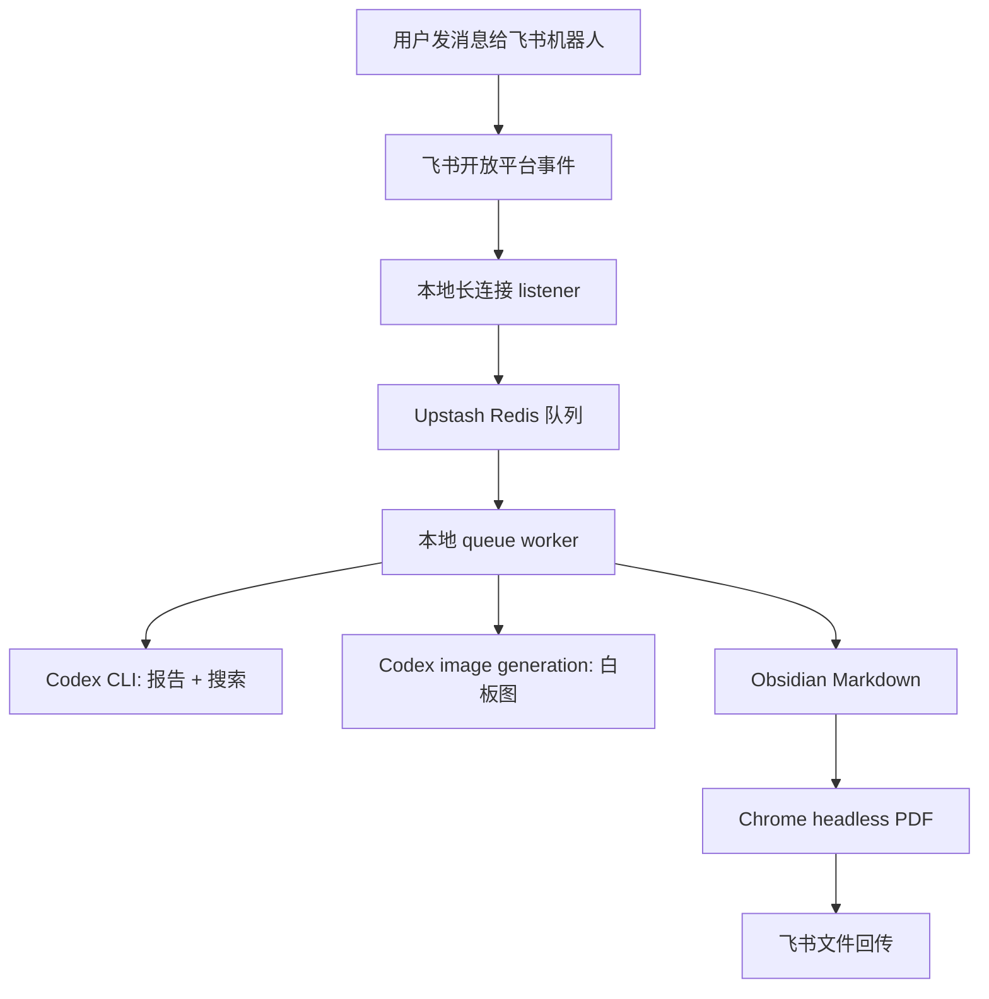

# Feishu Idea Catcher 技术原理与用户指引

本文档面向两类读者：

- 想直接使用的人：按步骤配置飞书、Upstash、Obsidian 和本地 worker。
- 想二次开发的人：理解系统边界、数据流、模块职责、失败路径和扩展方式。

## 1. 这个项目解决什么问题

很多想法发生在路上、会议里、聊天中。最好的入口往往不是一个新 App，而是已经每天打开的 IM 工具。

本项目把飞书机器人变成一个低摩擦入口：

1. 用户给机器人发一条想法。
2. 系统立即回复“已进入队列”。
3. 后台慢慢做 Codex 分析、竞品扫描、白板图和 PDF。
4. Markdown 报告沉淀到 Obsidian。
5. PDF 自动回传给用户。

设计原则：

- 入口要轻：发消息即可。
- 处理要稳：耗时任务进队列，不阻塞飞书回调。
- 结果要可读：短标题、中文报告、白板图、手机友好 PDF。
- 数据要可控：本地 worker 写 Obsidian，密钥只放本地环境变量。
- 合规要清楚：使用飞书官方开放平台，不自动化个人客户端。

## 2. 总体架构



### 为什么拆成 listener 和 worker

飞书事件需要快速响应。Codex 搜索、报告、图片生成和 PDF 导出都可能耗时几分钟。如果在事件回调里直接做这些事情，容易超时、重复触发或丢消息。

因此：

- `listener:feishu` 只负责收消息、去重、入队、回复确认。
- `worker:queue` 负责所有慢任务。

## 3. 核心模块

### `scripts/feishu-ws-worker.mjs`

飞书长连接监听器。

职责：

- 使用飞书官方 SDK 建立长连接。
- 接收 `im.message.receive_v1`。
- 只处理文字消息。
- 用 `message_id` 做本地去重。
- 把任务写入 Upstash Redis。
- 给用户回复“已进入慢任务队列”。

### `scripts/worker.mjs`

队列 worker。

职责：

- 从 Upstash 拉取 pending idea。
- 追加 `idea list.md`。
- 调用报告生成。
- 生成白板图提示词并调用 Codex image generation。
- 写入 Obsidian Markdown。
- 用 Chrome 导出 PDF。
- 调用飞书官方 API 上传 PDF 并回传。
- 标记任务完成或失败重试。

### `src/codex-report.mjs`

生成 CEO Review 报告。

默认 `REPORT_ENGINE=codex`，会调用本地 Codex CLI。报告包含：

- 一句话结论
- 想法定义
- 是否有人在做
- CEO Review
- 最小实现路线
- 风险与失败信号
- 下一步 3 个动作

报告标题会被自动提炼成短标题，避免使用原始长句。

### `src/whiteboard-prompt.mjs`

把报告内容压缩成白板图提示词。

注意：白板图解释的是“这个想法本身”，不是解释本自动化项目。它应该总结：

- 目标用户
- 真实痛点
- 核心体验闭环
- 风险边界
- 最小 MVP
- 下一步验证

### `src/image-generation.mjs`

生成白板图。

默认 `IMAGE_ENGINE=codex`：

- 使用本地 Codex app/CLI 已登录状态。
- 不需要 `OPENAI_API_KEY`。
- 会优先参考仓库内置的 `skills/haonan-image-whiteboard/SKILL.md` 风格规则。
- 先生成到临时 PNG。
- 再由主 worker 复制到 Obsidian assets 目录。

可选 `IMAGE_ENGINE=openai`：

- 使用 OpenAI Images API。
- 需要 `OPENAI_API_KEY`。

### `src/markdown.mjs` 和 `src/pdf.mjs`

Markdown 转 HTML，再由 Chrome headless 导出 PDF。

已针对手机阅读做了优化：

- 标题自动换行
- 较大字号
- 有序列表正确排版
- 加粗内容更醒目
- 表格尽量避免变形
- 图片自适应页面宽度

## 4. 环境变量说明

复制示例文件：

```bash
cp .env.example .env.local
```

### 必填

```text
WORKER_API_TOKEN
UPSTASH_REDIS_REST_URL
UPSTASH_REDIS_REST_TOKEN
FEISHU_APP_ID
FEISHU_APP_SECRET
OBSIDIAN_IDEA_LIST_DIR
OBSIDIAN_REPORT_DIR
OBSIDIAN_VAULT_ROOT
OBSIDIAN_VAULT_NAME
```

### 常用可选项

```text
REPORT_PERSONA=架构评审助手
REPORT_ENGINE=codex
RESEARCH_ENGINE=codex
IMAGE_ENGINE=codex
PDF_RENDERER=chrome
WHITEBOARD_SIGNATURE=
```

### 不要提交

`.env.local` 包含密钥，永远不要提交到 GitHub。

## 5. 飞书配置

### 5.1 创建或选择自建应用

进入飞书开放平台，使用自建应用。

不要使用“自定义群机器人 Webhook”。Webhook 适合单向通知，不适合接收用户发给机器人的消息并回传文件。

### 5.2 开启能力

需要：

- 机器人能力
- 接收消息事件
- 发送消息权限
- 上传文件权限

### 5.3 订阅事件

推荐使用长连接：

- 进入事件与回调。
- 选择“使用长连接接收回调”。
- 订阅 `im.message.receive_v1`。

长连接模式只需要：

```text
FEISHU_APP_ID
FEISHU_APP_SECRET
```

不需要：

```text
FEISHU_VERIFICATION_TOKEN
FEISHU_ENCRYPT_KEY
```

这些只在 HTTP callback 加密或 URL verification 场景下需要。

## 6. Upstash Redis

创建 Redis 数据库后复制：

```text
UPSTASH_REDIS_REST_URL
UPSTASH_REDIS_REST_TOKEN
```

本项目把 Redis 用作：

- 去重记录
- pending 队列
- idea 状态表
- 失败重试记录

主要 key：

```text
pending_ideas
idea:{id}
seen_message:{message_id}
```

## 7. Obsidian 输出

推荐结构：

```text
Ideas/
  idea list.md
  plan-ceo-review/
    20260612/
      20260612-short-title.md
      assets/
        20260612-short-title/
          20260612-short-title-whiteboard.png
          20260612-short-title-whiteboard-prompt.md
```

环境变量：

```text
OBSIDIAN_IDEA_LIST_DIR=/path/to/vault/Ideas
OBSIDIAN_REPORT_DIR=/path/to/vault/Ideas/plan-ceo-review
OBSIDIAN_VAULT_ROOT=/path/to/vault
OBSIDIAN_VAULT_NAME=Your Vault Name
```

## 8. 本地运行

安装依赖：

```bash
npm install
```

检查配置：

```bash
npm run doctor
```

本地测试一条想法：

```bash
npm run test:local -- "我想做一个帮助老师把病例变成诊断思维训练材料的工具"
```

启动长连接监听器：

```bash
npm run listener:feishu
```

另开一个终端启动 worker：

```bash
npm run worker:queue
```

## 9. 用户怎么使用

### 普通分析

给飞书机器人发：

```text
我想做一个帮助带教医生基于病历整理诊断思维图谱的工具
```

系统会：

1. 回复已进入队列。
2. 写入 `idea list.md`。
3. 生成 CEO Review。
4. 生成白板图。
5. 写入 Obsidian。
6. 导出 PDF。
7. 把 PDF 回传到飞书。

### 快速记录

如果只想记录，不想分析：

```text
快速记录，不用分析：以后想做一个病例教学题库
```

系统只追加 `idea list.md`，不会调用 Codex，也不会生成 PDF。

## 10. 报告格式

报告固定章节：

```text
0. 一句话结论
1. 这个想法到底是什么
2. 是否已经有人在做
3. CEO Review
4. 最小实现路线
5. 风险与失败信号
6. 下一步 3 个动作
```

报告会自动：

- 改写短标题
- 加粗关键判断
- 避免复杂表格
- 使用中文
- 把竞品链接保留在正文

## 11. 图片生成

默认：

```text
IMAGE_ENGINE=codex
```

这会使用本地 Codex image generation，不需要 OpenAI API key。

仓库内置了一个干净版白板图 skill：

```text
skills/haonan-image-whiteboard/SKILL.md
```

它定义了白底、手绘线条、中文大字、手机可读、无默认个人署名的视觉规则。worker 调用 Codex 生图时会要求优先参考这个文件。

如果你想禁用图片：

```text
IMAGE_ENGINE=none
```

如果你想使用 OpenAI API：

```text
IMAGE_ENGINE=openai
OPENAI_API_KEY=...
```

可选署名：

```text
WHITEBOARD_SIGNATURE=Your Name
```

留空则不添加个人签名。

## 12. PDF 导出

默认：

```text
PDF_RENDERER=chrome
```

需要本机 Chrome。worker 会自动把 Markdown 转成 HTML，再用 Chrome headless 导出 PDF。

如果 Chrome 在受限环境里报 `SIGABRT`，请在普通终端、LaunchAgent 或系统服务里运行 worker，不要放在严格沙箱里。

## 13. macOS 常驻与定时启动

临时使用时，可以开两个终端分别运行：

```bash
npm run listener:feishu
npm run worker:queue
```

如果要让 Codex 自动化、系统定时任务或其他调度器每天自动启动/停止，推荐使用项目内置的 launchd 包装命令：

```bash
npm run launchd:install
npm run launchd:start
npm run launchd:status
npm run launchd:stop
```

原因是：Codex 自动化或某些调度器可能运行在受限环境中，直接派生长期联网进程时，飞书和 Upstash 可能遇到 DNS/网络限制。`launchd:start` 会把 listener 和 worker 注册成当前 macOS 用户的 LaunchAgent，由系统用户服务承载长期运行。

生成的 plist 位于：

```text
~/Library/LaunchAgents/com.feishu-idea-catcher.listener.plist
~/Library/LaunchAgents/com.feishu-idea-catcher.worker.plist
```

日志位于：

```text
state/launchd-listener.out.log
state/launchd-listener.err.log
state/launchd-worker.out.log
state/launchd-worker.err.log
```

如果要每天自动启动和停止，不要让 Codex 自动化直接执行 `launchd:start` / `launchd:stop`。某些自动化运行环境没有 `launchctl bootstrap` 所需权限。推荐改为安装真正的 macOS 定时 LaunchAgent：

```bash
npm run launchd:schedule:install
npm run launchd:schedule:status
```

默认定时：

```text
06:00 start
00:00 stop
```

安装后会新增：

```text
~/Library/LaunchAgents/com.feishu-idea-catcher.schedule-start.plist
~/Library/LaunchAgents/com.feishu-idea-catcher.schedule-stop.plist
```

Codex 自动化适合做结果检查，而不是直接启动/停止：

```text
早上检查：运行 npm run launchd:status 和 npm run launchd:schedule:status，报告 listener/worker 是否 running。
晚上检查：运行 npm run launchd:status 和 npm run launchd:schedule:status，报告 listener/worker 是否 stopped/not_loaded。
```

如果同一台 Mac 上有多个项目副本，可以用环境变量换一个 label 前缀，避免 LaunchAgent 名称冲突：

```bash
LAUNCHD_LABEL_PREFIX=com.example.my-idea-catcher npm run launchd:start
```

如果 Node 不在常见路径，或你想固定 Node 可执行文件：

```bash
LAUNCHD_NODE_BIN=/opt/homebrew/bin/node npm run launchd:start
```

`local:start` / `local:stop` / `local:status` 也保留给普通终端手动调试使用，但定时自动化更推荐 `launchd:*`。

## 14. 可选 Vercel HTTP 模式

长连接模式已经足够自用。Vercel 模式适合：

- 你想用 HTTP event callback。
- 你想让多个本地 worker 通过云端 API 取任务。
- 你想做团队版。

同步环境变量：

```bash
npm run push:vercel-env -- --scope=your-vercel-scope
```

部署：

```bash
npm --registry=https://registry.npmjs.org exec --yes vercel@latest -- deploy --prod --yes --scope your-vercel-scope
```

飞书 HTTP 回调 URL：

```text
https://your-vercel-project.vercel.app/api/feishu/events
```

## 15. 故障排查

### 飞书没有响应

检查：

- `npm run listener:feishu` 是否在运行。
- 飞书是否启用长连接。
- 是否订阅 `im.message.receive_v1`。
- `FEISHU_APP_ID` 和 `FEISHU_APP_SECRET` 是否正确。

### 入队成功但没有报告

检查：

- `npm run worker:queue` 是否在运行。
- Upstash REST URL/token 是否正确。
- `state/feishu-ws-worker.log` 中是否有 `processing`。

### Codex 报告失败

检查：

- Codex app 是否安装。
- `CODEX_BIN` 是否正确。
- Codex 是否已登录。
- `CODEX_REPORT_TIMEOUT_MS` 是否太短。

### 白板图失败

检查：

- `IMAGE_ENGINE` 是否为 `codex`。
- Codex 是否支持 image generation。
- worker 是否在普通终端或允许访问 Codex 状态的环境中运行。
- `CODEX_IMAGE_TIMEOUT_MS` 是否足够长。

### PDF 失败

检查：

- `CHROME_BIN` 是否正确。
- Chrome 是否能在当前环境 headless 启动。
- `PDF_OUTPUT_DIR` 是否可写。

### 飞书没有收到 PDF

检查：

- 飞书应用是否有上传文件权限。
- 机器人是否能给当前会话发消息。
- worker 日志中是否有 `done`。

## 16. 开源前安全清单

提交 GitHub 前确认：

- `.env.local` 没有提交。
- `.vercel/` 没有提交。
- `state/` 没有提交。
- 日志没有提交。
- PDF/HTML 产物没有提交。
- README 没有写死个人部署地址。
- 示例配置只包含占位符。
- 如果任何密钥曾经进入公开仓库，立刻去对应平台轮换。

可以运行：

```bash
rg -n "sk-|secret|token|password|cli_|upstash|vercel.app|absolute/path" -g '!node_modules' -g '!.env.local' -g '!state'
```

命中不一定都是泄露，但需要逐条确认。
